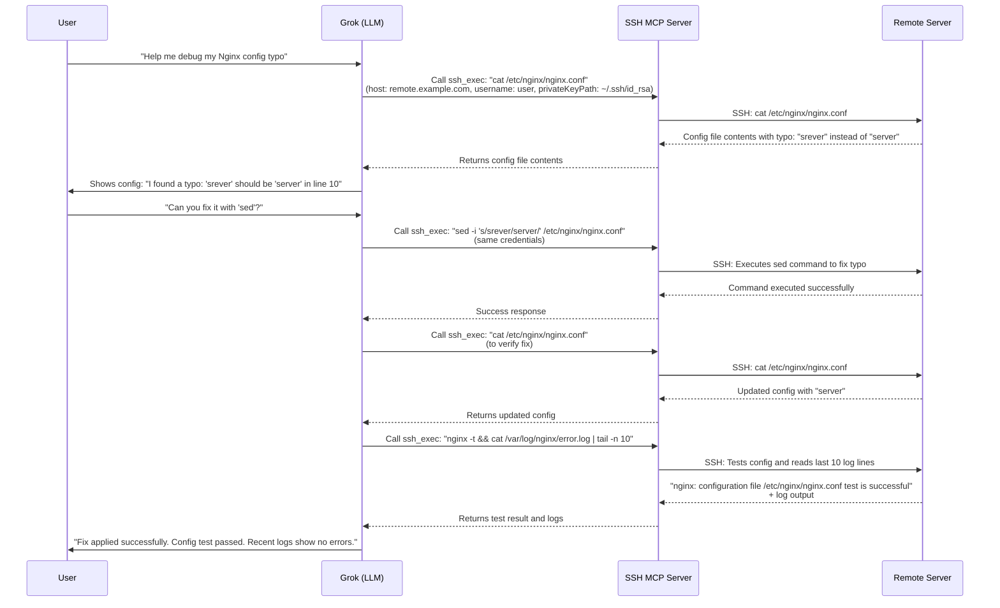

# Nginx Typo Debugging Flow with SSH Tools

## Typo Debugging Scenario

1. **SSH Tool Usage** (Green):
   - Execute diagnostic commands
   - Edit configuration files
   - Service management
   - Secure credential storage

2. **Debugging Flow**:
   1. User reports unexpected 500 errors
   2. Model checks error logs via SSH: `grep error /var/log/nginx/error.log`
   3. Identifies "unknowndirective" typo in config
   4. Models directs config edit:
      `sed -i 's/unknowndirective/known_directive/g' /etc/nginx/nginx.conf`
   5. Validate configuration with `nginx -t`
   6. Graceful restart: `systemctl reload nginx`
   7. Confirm site functionality restored
